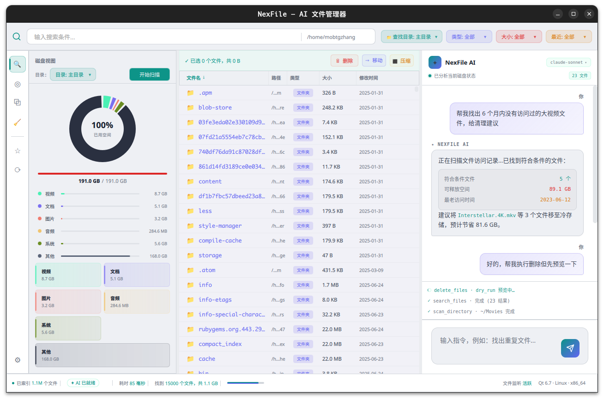

# NexFile — AI 文件管理器

类似 Everything + Filelight 的智能文件管理器，集成 AI Agent 实现自然语言驱动的文件搜索、分析与管理。基于 Qt 6 / QML 构建，支持 Dark / Light 双主题。



## 功能特性

- **即时搜索**：类 Everything 的全盘文件索引与毫秒级搜索，支持按类型、大小、时间筛选
- **磁盘可视化**：环形图 + 矩形树图展示磁盘空间占用，支持交互式下钻
- **AI 智能助手**：通过自然语言与 AI 对话，自动执行文件搜索、清理建议、批量操作
- **Function Calling**：AI 可调用 `search_files`、`delete_files`、`move_files`、`scan_directory`、`shell`、`web_search` 等工具
- **重复文件检测**：基于内容哈希的重复文件扫描
- **系统清理建议**：自动发现过期/冗余文件并给出清理方案
- **双主题**：Dark / Light 模式一键切换

## 项目结构

```
FileSearch/
├── src/
│   ├── main.cpp                    # 入口
│   ├── AppSettings.h/cpp           # 应用设置（主题等）
│   ├── PathProvider.h/cpp          # 路径提供
│   ├── StatusContext.h/cpp         # 状态上下文
│   ├── agent/                      # AI Agent
│   │   ├── AIBridge                # LLM 接口封装
│   │   ├── ChatBridge              # QML ↔ Web 聊天桥接
│   │   ├── AgentOrchestrator       # Agent 编排器
│   │   ├── ToolExecutor            # Function Calling 执行器
│   │   ├── ContextBuilder          # 上下文构建
│   │   ├── CacheManager            # 缓存管理
│   │   └── tools/                  # Agent 原子工具
│   │       ├── IAgentTool          # 工具基类接口
│   │       ├── SearchFilesTool     # 搜索文件
│   │       ├── DeleteFilesTool     # 删除文件
│   │       ├── MoveFilesTool       # 移动文件
│   │       ├── ShellTool           # Shell 命令执行
│   │       └── WebSearchTool       # 网络搜索
│   ├── engine/                     # 搜索与扫描引擎
│   │   ├── SearchEngine            # 搜索执行
│   │   ├── IndexEngine             # 文件索引
│   │   ├── ScanEngine / ScanWorker # 磁盘扫描
│   │   ├── DuplicateEngine/Worker  # 重复文件检测
│   │   └── CleanupEngine/Worker    # 清理引擎
│   ├── model/                      # 数据模型
│   │   ├── FileItemModel           # 文件列表模型
│   │   └── UnifiedFileRecord       # 统一文件记录
│   └── service/                    # 文件操作服务
│       └── FileOperationService
├── qml/
│   ├── main.qml                    # 主窗口布局
│   ├── ai-chat/
│   │   └── index.html              # AI 聊天 Web UI
│   ├── theme/                      # 主题与全局上下文
│   │   ├── Theme.qml               # 色彩/字体定义
│   │   └── *Context.qml            # 各功能模块上下文
│   └── components/                 # UI 组件
│       ├── TitleBar / SearchBar / Sidebar / StatusBar
│       ├── FileListPanel / FileRowDelegate
│       ├── VizPanel / RadialMapView / TreeMapView
│       ├── AIChatPanel / ChatMessage / ToolStatusRow
│       ├── DuplicateFilePage / FileCleanupPage / SystemCleanupPage
│       └── SettingsDialog / FilterPopMenu / ...
├── docs/
│   ├── framework.md                # 架构设计文档
│   └── agentflow.md                # Agent 流程文档
├── CMakeLists.txt
└── Makefile
```

## 构建与运行

### 使用 Makefile（推荐）

```bash
make compile   # 编译
make run       # 编译并运行
make run-only  # 仅运行（不重新编译）
make clean     # 清理构建产物
make rebuild   # 完全重新编译
make help      # 查看帮助
```

### 使用 CMake

```bash
mkdir build && cd build
cmake -DCMAKE_PREFIX_PATH=/path/to/Qt/6.x/gcc_64 ..
make
./FileSearch
```

> **注意**：需从项目根目录运行，以便正确加载 `qml/` 资源目录。

## 界面说明

- **标题栏**：NexFile 品牌标识、索引状态、AI 就绪指示
- **搜索栏**：即时搜索 + 类型/大小/时间筛选标签 + AI 助手入口
- **左侧导航**：搜索、磁盘可视化、重复文件、清理建议、收藏、历史、设置
- **可视化面板**：环形图 / 矩形树图展示磁盘占用，点击可下钻并联动文件列表
- **文件列表**：文件名 / 路径 / 类型 / 大小 / 修改日期，支持多选与批量删除、移动、压缩
- **AI 面板**：自然语言对话、工具调用实时状态（`search_files`、`delete_files` 等）、对话历史
- **状态栏**：已索引文件数、搜索耗时、磁盘总量、文件监听状态

## 开发路线

| 阶段 | 内容 | 状态 |
|------|------|------|
| **Phase 1** | 文件索引、基础搜索、磁盘扫描、搜索 ↔ 图表联动 | ✅ 已完成 |
| **Phase 2** | AI 接入、自然语言搜索、Function Calling、Agent 编排 | ✅ 已完成 |
| **Phase 3** | 语义搜索、重复检测、文件清理、跨设备索引 | 进行中 |

## 依赖

- **Qt 6.x**（Core, Gui, Quick, QuickControls2, Qml, WebEngineQuick, WebChannel, QuickDialogs2, Concurrent, Network）
- Qt 安装路径可在 `CMakeLists.txt` 中通过 `CMAKE_PREFIX_PATH` 修改
- AI 聊天面板基于 Qt WebEngine 渲染 `qml/ai-chat/index.html`
- C++17 标准

## 主题

- **Dark 模式**：深色背景（默认）
- **Light 模式**：浅色背景
- 通过左侧导航栏 ⚙ 设置页面切换主题

## 文档

- [架构设计](docs/framework.md) — 完整分层架构与模块设计
- [Agent 流程](docs/agentflow.md) — AI Agent 编排与工具调用流程
